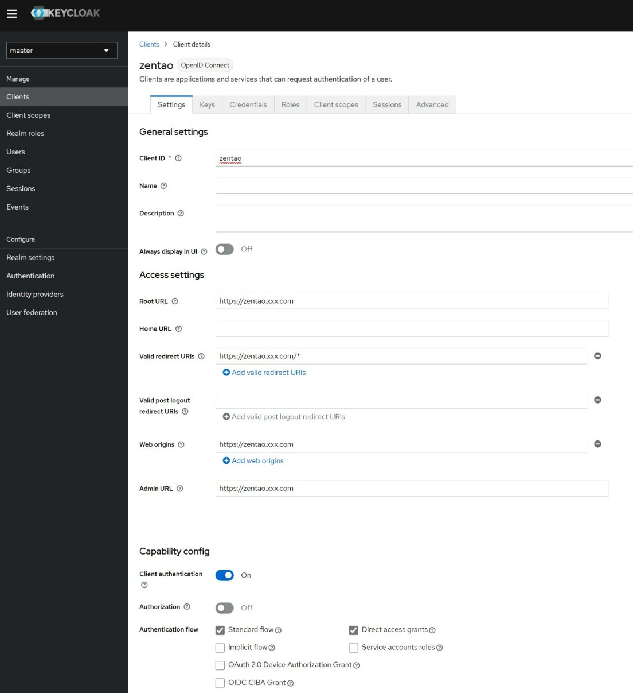
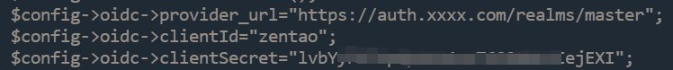

## 介绍
本插件用于禅道支持基于OpenID Connect的SSO登录。   

请在oidc提供者的userinfo中配置`chinesename`字段，用于在禅道中显示用户中文姓名。

## 已测试版本

禅道：开源版18.8、开源版21.4、开源版21.7.8
Keycloak：23.0.7、26.5.1

## 使用方法（已Keycloak为例）
1. 在Keycloak的Clients页面中添加新的OpenID Connect类型的client。例如：   

2. 在新创建的client中拿到secret：   

3. 在Keycloak的Realm roles页面添加新的角色：`zentao_admin`。并将希望登录禅道后自动赋予管理员角色的用户关联到该角色上，注：只有在禅道中新创建用户时才会自动赋予管理员角色。
4. 在本项目的release页面下载最新插件安装包。
5. 使用本地管理员登录禅道，并使用禅道的插件本地安装功能安装本插件。
6. 编辑`extension/pkg/oidc/config/ext/oidc.php`文件:   

7. 缺省情况下，禅道是使用传统的GET请求方式，这种方式不允许URL参数中包含字符`:`，和OpenID Connect Authentication Response中的iss参数冲突。有两种解决方案：
    * 编辑`config/my.php`文件并修改以下选项:   
    ```$config->requestType     = 'PATH_INFO';```
    * 将Keycloak中client的advanced选项中的`Exclude Issuer From Authentication Response`选项打开。   
   
8. 重启禅道后，点击`单点登录`按钮，在Keycloak中输入账号登录。

## 更新日志

2026.01.16 更新last登录时间的取值逻辑，防止因last格式不对导致在mysql8+版本严格模式（Strict Mode）中报错。