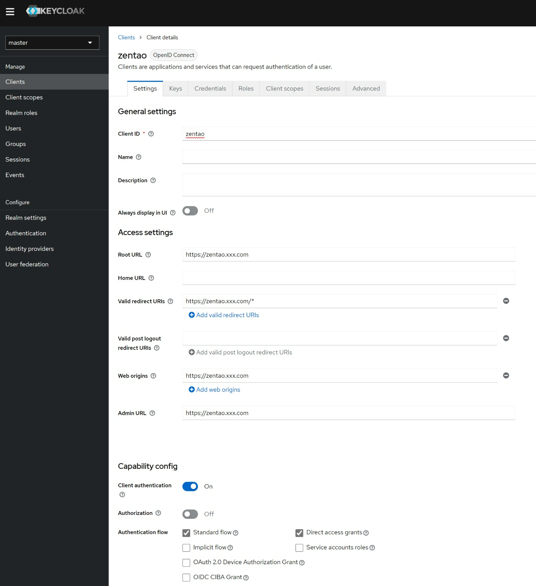
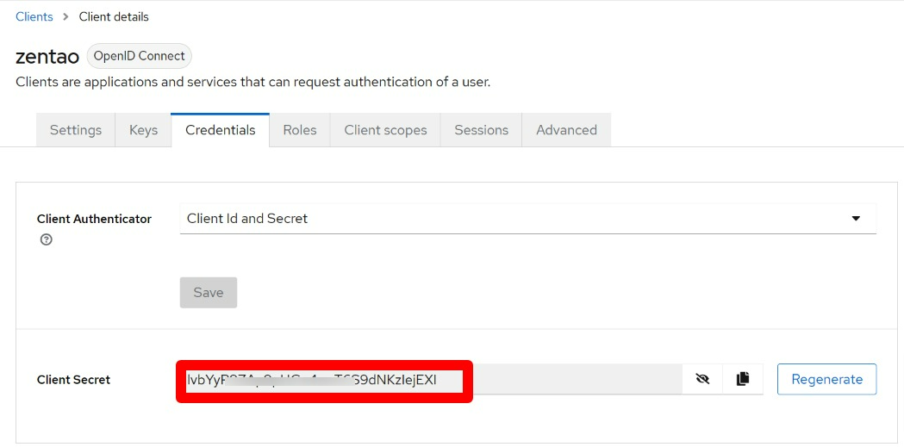
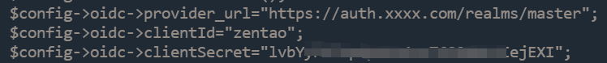

本插件用于禅道支持基于OpenID Connect的SSO登录。   
在禅道开源版18.8、21.4及Keycloak 23.0.7上验证通过。

使用方法（已Keycloak为例）：
1. 在Keycloak的Clients页面中添加新的OpenID Connect类型的client。例如：   

2. 在新创建的client中拿到secret：   

3. 在Keycloak的Realm roles页面添加新的角色：zentao_admin。并将希望登录禅道后自动赋予管理员角色的用户关联到该角色上，注：只有在禅道中新创建用户时才会自动赋予管理员角色。
4. 在本项目的release页面下载最新插件安装包。
5. 使用本地管理员登录禅道，并使用禅道的插件本地安装功能安装本插件。
6. 编辑config/ext/oidc.php文件，并将以下值设为Keycloak中的数据。如果是用Docker镜像安装的，请编辑/data/zentao/extension/pkg/oidc/config/ext/oidc.php文件。否则容器重启后，编辑的内容将会丢失。   

7. 退出本地管理员登录，点击“单点登录”按钮，输入Keycloak中的用户账号登录。
